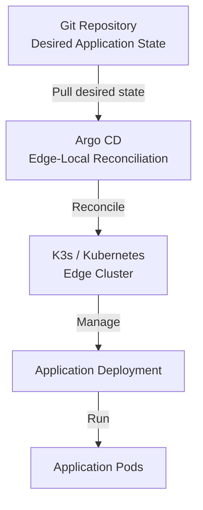

# Edge-Local Pull-Based GitOps for Edge Clusters

## Overview

This repository contains the artefact and experimental testbed developed for the dissertation:

**Edge-Local Pull-Based GitOps for Edge Clusters**

The project implements a pull-based GitOps deployment workflow using K3s, K3d, Argo CD, and Kustomize. It provides a reproducible multi-node Kubernetes environment for evaluating application-state reconciliation and workload convergence under controlled node and network degradation.

## Architecture

The architecture consists of:

- Git as the version-controlled source of desired application configuration.
- K3d providing a reproducible containerised K3s environment.
- K3s providing lightweight Kubernetes orchestration.
- Argo CD operating within the edge cluster as the GitOps reconciliation controller.
- Kustomize providing declarative Kubernetes configuration management.
- Kubernetes managing application workload placement and Pod lifecycle.

The deployment workflow is:

### Deployment Workflow




Argo CD operates within the edge cluster and retrieves the desired application configuration from Git for local reconciliation.

The architecture remains dependent on upstream Git connectivity when new desired-state revisions need to be retrieved.

## Experimental Evaluation

The testbed is used to evaluate:

1. Baseline application synchronisation.
2. Git-based replica scaling.
3. Application-state convergence.
4. Node degradation and isolation.
5. Deployment configuration changes during node disruption.
6. Workload rescheduling and recovery.

The experiments are conducted under controlled conditions using K3d/K3s.

## Repository Structure

```text
apps/             Kubernetes application manifests and Kustomize configuration
clusters/         Argo CD application definitions for the edge cluster
docs/             Architecture and supporting documentation
security/         Security-related notes and considerations
README.md         Overview of the artefact and project
QUICKSTART.md     Setup and execution guide
```
